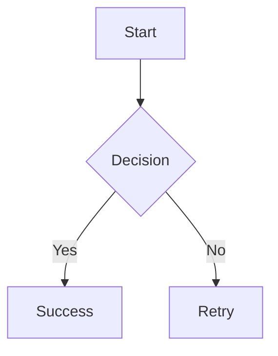

# MD Editor Pro

A cross-platform markdown editor built with Electron, supporting CommonMark and GitHub Flavored Markdown (GFM).

## Features

- Real-time markdown editing and preview
- CommonMark and GFM support (tables, strikethrough, task lists)
- **Advanced Markdown Features:**
  - **Mermaid Diagrams**: Create flowcharts, sequence diagrams, class diagrams, and more
  - **Mathematical Formulas**: Write LaTeX math expressions with KaTeX
  - **Callout Blocks**: Highlight important information with styled callouts
- Syntax highlighting for code blocks and Mermaid diagrams
- Export to HTML and PDF (including advanced features)
- Light and dark themes
- Cross-platform (Windows, Linux, macOS)
- Find and replace functionality
- Configurable feature toggles for performance optimization

## Advanced Markdown Features

MD Editor Pro includes powerful extensions beyond standard markdown to help you create rich technical documentation.

### Mermaid Diagrams

Create diagrams using Mermaid's text-based syntax. Simply use a fenced code block with the `mermaid` language identifier:

````markdown

````

**Supported Diagram Types:**

- **Flowcharts**: Visualize processes and workflows
- **Sequence Diagrams**: Show interactions between components
- **Class Diagrams**: Document object-oriented designs
- **State Diagrams**: Model state machines
- **Entity Relationship Diagrams**: Design database schemas
- **Gantt Charts**: Plan project timelines
- **Pie Charts**: Display data distributions
- **Git Graphs**: Visualize version control branching

For more examples, see `examples/advanced-markdown-demo.md`.

### Mathematical Formulas (KaTeX)

Write mathematical expressions using LaTeX syntax:

**Inline Math**: Wrap expressions in single dollar signs: `$E = mc^2$` renders as $E = mc^2$

**Display Math**: Use double dollar signs for block formulas:

```markdown
$$
\int_{-\infty}^{\infty} e^{-x^2} dx = \sqrt{\pi}
$$
```

KaTeX supports a wide range of LaTeX commands including:
- Greek letters: `\alpha`, `\beta`, `\gamma`
- Operators: `\sum`, `\int`, `\prod`, `\lim`
- Fractions: `\frac{a}{b}`
- Matrices: `\begin{bmatrix}...\end{bmatrix}`
- And much more!

### Callout Blocks

Highlight important information with visually distinct callout blocks:

```markdown
> [!NOTE]
> This is a note callout for general information.

> [!TIP]
> This is a tip callout for helpful advice.

> [!IMPORTANT]
> This is an important callout for critical information.

> [!WARNING]
> This is a warning callout for potential issues.

> [!CAUTION]
> This is a caution callout for dangerous situations.
```

Each callout type has distinct styling with appropriate colors and icons.

### Configuring Advanced Features

You can enable or disable advanced markdown features individually through the settings:

1. Open Settings (File → Settings or `Ctrl+,`)
2. Navigate to the "Advanced Markdown Features" section
3. Toggle features on/off:
   - Enable/disable Mermaid Diagrams
   - Enable/disable Mathematical Formulas (KaTeX)
   - Enable/disable Callout Blocks

Disabling unused features can improve editor performance for large documents.

### Exporting Documents with Advanced Features

When exporting to HTML or PDF, all advanced markdown features are preserved:

- **HTML Export**: Includes rendered Mermaid SVGs, KaTeX formulas, and styled callouts
- **PDF Export**: Generates PDFs with all visual elements intact

Use File → Export to access export options.

## Development

### Prerequisites

- Node.js (v18 or higher)
- npm

### Installation

```bash
npm install
```

### Running in Development

```bash
npm start
```

### Running Tests

```bash
# Run all automated tests
npm test

# Run tests in watch mode
npm run test:watch

# Run tests with coverage
npm test -- --coverage
```

For comprehensive testing documentation, see:
- **TESTING_QUICKSTART.md** - Quick start guide for testing (5 minutes)
- **TESTING_GUIDE.md** - Complete manual testing procedures
- **TESTING_SUMMARY.md** - Current testing status and overview
- **AUTOMATED_TESTING.md** - Guide to automated test suite

### Building

Before building, ensure you have icon files in the `build/` directory:
- `icon.ico` for Windows
- `icon.icns` for macOS  
- `icon.png` for Linux

See `build/README.md` for instructions on creating icons.

```bash
# Build for all platforms
npm run build

# Build for specific platform
npm run build:win    # Windows (NSIS installer + portable)
npm run build:mac    # macOS (DMG + ZIP for x64 and ARM64)
npm run build:linux  # Linux (AppImage, DEB, RPM)
```

Build outputs will be in the `dist/` directory.

#### Build Targets

- **Windows**: NSIS installer (x64, ia32) and portable executable (x64)
- **macOS**: DMG and ZIP archives (x64 and ARM64/Apple Silicon)
- **Linux**: AppImage, DEB, and RPM packages (x64)

#### Auto-Updates

The application is configured for auto-updates via GitHub releases. To enable:
1. Set up a GitHub repository
2. Configure GitHub token in environment
3. Publish releases using `npm run build` with proper version tags

## Project Structure

```
markdown-editor/
├── src/
│   ├── main/          # Main process (Electron)
│   ├── renderer/      # Renderer process (UI)
│   └── preload/       # Preload scripts (IPC bridge)
├── package.json
└── README.md
```

## License

ISC
