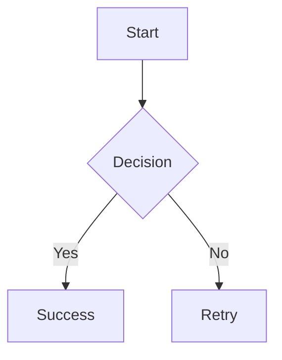

# MD Editor Pro

<div align="center">


A powerful, cross-platform markdown editor built with Electron, featuring real-time preview, advanced markdown support, and a modern editing experience.

[Features](#features) • [Installation](#installation) • [Usage](#usage) • [Development](#development) • [Building](#building)

</div>

---

## Features

### Core Editing
- **Real-time Preview** - Live markdown rendering with synchronized scrolling
- **CodeMirror 6 Editor** - Modern, extensible code editor with syntax highlighting
- **Multi-tab Interface** - Work on multiple documents simultaneously with session persistence
- **Multiple Cursors** - Edit multiple locations at once (Ctrl+Click, Ctrl+D)
- **Typewriter Scrolling** - Keep active line centered for comfortable writing
- **Focus Mode** - Distraction-free writing environment (F11)

### Markdown Support
- **CommonMark & GFM** - Full support for tables, strikethrough, task lists
- **Mermaid Diagrams** - Create flowcharts, sequence diagrams, class diagrams, ER diagrams, Gantt charts, and more
- **Mathematical Formulas** - Write LaTeX expressions with KaTeX (inline and display mode)
- **Callout Blocks** - Highlight important information (NOTE, TIP, IMPORTANT, WARNING, CAUTION)
- **Syntax Highlighting** - Code blocks with highlight.js support for 190+ languages

### Navigation & Search
- **Global Search** - Search across all files in workspace (Ctrl+Shift+F)
- **Outline Panel** - Navigate document structure with hierarchical header view (Ctrl+Shift+O)
- **File Tree Sidebar** - Browse and manage markdown files in your workspace (Ctrl+Shift+E)
- **Activity Bar** - VS Code-style sidebar with Explorer, Search, and Outline views
- **Find & Replace** - Search and replace within current document

### Productivity
- **Templates System** - Built-in and custom templates with placeholder navigation
- **Snippets Manager** - Reusable text blocks with custom triggers
- **Auto-save** - Configurable automatic saving with adjustable delay
- **Image Paste** - Paste images from clipboard, auto-saved to assets folder
- **Document Statistics** - Word count, character count, reading time
- **Customizable Shortcuts** - Configure keyboard shortcuts to your preference

### Themes & Appearance
- **7 Professional Themes** - Light, Dark, Solarized, Dracula, Monokai, Nord
- **Theme Selector** - Visual theme picker with live preview (Ctrl+K Ctrl+T)
- **Quick Theme Toggle** - Switch between light/dark modes instantly

### Export & Sharing
- **HTML Export** - Export with all advanced features preserved
- **PDF Export** - Generate PDFs with diagrams, formulas, and styling intact

### Cross-Platform
- **Windows** - NSIS installer and portable executable
- **macOS** - DMG and ZIP for Intel and Apple Silicon
- **Linux** - AppImage, DEB, and RPM packages
- **File Associations** - Open .md and .markdown files directly

## Advanced Markdown Features

MD Editor Pro includes powerful extensions beyond standard markdown to help you create rich technical documentation.

### Mermaid Diagrams

Create diagrams using Mermaid's text-based syntax. Simply use a fenced code block with the `mermaid` language identifier:

````markdown

````

**Supported Diagram Types:**

- **Flowcharts**: Visualize processes and workflows
- **Sequence Diagrams**: Show interactions between components
- **Class Diagrams**: Document object-oriented designs
- **State Diagrams**: Model state machines
- **Entity Relationship Diagrams**: Design database schemas
- **Gantt Charts**: Plan project timelines
- **Pie Charts**: Display data distributions
- **Git Graphs**: Visualize version control branching

For more examples, see `examples/advanced-markdown-demo.md`.

### Mathematical Formulas (KaTeX)

Write mathematical expressions using LaTeX syntax:

**Inline Math**: Wrap expressions in single dollar signs: `$E = mc^2$` renders as $E = mc^2$

**Display Math**: Use double dollar signs for block formulas:

```markdown
$$
\int_{-\infty}^{\infty} e^{-x^2} dx = \sqrt{\pi}
$$
```

KaTeX supports a wide range of LaTeX commands including:
- Greek letters: `\alpha`, `\beta`, `\gamma`
- Operators: `\sum`, `\int`, `\prod`, `\lim`
- Fractions: `\frac{a}{b}`
- Matrices: `\begin{bmatrix}...\end{bmatrix}`
- And much more!

### Callout Blocks

Highlight important information with visually distinct callout blocks:

```markdown
> [!NOTE]
> This is a note callout for general information.

> [!TIP]
> This is a tip callout for helpful advice.

> [!IMPORTANT]
> This is an important callout for critical information.

> [!WARNING]
> This is a warning callout for potential issues.

> [!CAUTION]
> This is a caution callout for dangerous situations.
```

Each callout type has distinct styling with appropriate colors and icons.

### Configuring Advanced Features

You can enable or disable advanced markdown features individually through the settings:

1. Open Settings (File → Settings or `Ctrl+,`)
2. Navigate to the "Advanced Markdown Features" section
3. Toggle features on/off:
   - Enable/disable Mermaid Diagrams
   - Enable/disable Mathematical Formulas (KaTeX)
   - Enable/disable Callout Blocks

Disabling unused features can improve editor performance for large documents.

### Exporting Documents with Advanced Features

When exporting to HTML or PDF, all advanced markdown features are preserved:

- **HTML Export**: Includes rendered Mermaid SVGs, KaTeX formulas, and styled callouts
- **PDF Export**: Generates PDFs with all visual elements intact

Use File → Export to access export options.

---

## Installation

### Download Pre-built Binaries

Download the latest release for your platform from the [Releases](https://github.com/leandrolsouza/MD-Editor-Pro/releases) page:

- **Windows**: `MD-Editor-Pro-{version}-x64.exe` (installer) or portable version
- **macOS**: `MD-Editor-Pro-{version}-x64.dmg` (Intel) or `MD-Editor-Pro-{version}-arm64.dmg` (Apple Silicon)
- **Linux**: `MD-Editor-Pro-{version}-x64.AppImage`, `.deb`, or `.rpm`

### Installation Instructions

#### Windows
1. Download the `.exe` installer
2. Run the installer and follow the setup wizard
3. Launch MD Editor Pro from the Start Menu or desktop shortcut

For portable version, simply extract and run the executable.

#### macOS
1. Download the appropriate `.dmg` file for your architecture
2. Open the DMG and drag MD Editor Pro to Applications
3. Launch from Applications folder

Note: On first launch, you may need to right-click and select "Open" to bypass Gatekeeper.

#### Linux

**AppImage** (recommended):
```bash
chmod +x MD-Editor-Pro-*.AppImage
./MD-Editor-Pro-*.AppImage
```

**Debian/Ubuntu (.deb)**:
```bash
sudo dpkg -i MD-Editor-Pro-*.deb
sudo apt-get install -f  # Install dependencies if needed
```

**Fedora/RHEL (.rpm)**:
```bash
sudo rpm -i MD-Editor-Pro-*.rpm
```

---

## Usage

### Quick Start

1. **Create or Open a File**
   - File → New (Ctrl+N) to create a new document
   - File → Open (Ctrl+O) to open an existing markdown file
   - Drag and drop .md files into the editor

2. **Choose Your View**
   - View → Editor Only - Focus on writing
   - View → Preview Only - See rendered output
   - View → Split View - Edit and preview side-by-side (default)

3. **Start Writing**
   - Use the formatting toolbar for quick formatting
   - Insert → [Element] for headers, lists, tables, images, links
   - Type `#` for headers, `-` for lists, `` ` `` for code

4. **Save Your Work**
   - File → Save (Ctrl+S) to save manually
   - Enable auto-save in Settings for automatic saving

### Keyboard Shortcuts

| Action | Windows/Linux | macOS |
|--------|--------------|-------|
| New File | Ctrl+N | Cmd+N |
| Open File | Ctrl+O | Cmd+O |
| Save | Ctrl+S | Cmd+S |
| Find | Ctrl+F | Cmd+F |
| Global Search | Ctrl+Shift+F | Cmd+Shift+F |
| Replace | Ctrl+H | Cmd+H |
| Toggle Theme | Ctrl+T | Cmd+T |
| Theme Selector | Ctrl+K Ctrl+T | Cmd+K Cmd+T |
| Focus Mode | F11 | F11 |
| File Tree | Ctrl+Shift+E | Cmd+Shift+E |
| Outline | Ctrl+Shift+O | Cmd+Shift+O |
| Typewriter Scroll | Ctrl+Shift+T | Cmd+Shift+T |
| Bold | Ctrl+B | Cmd+B |
| Italic | Ctrl+I | Cmd+I |
| Next Tab | Ctrl+Tab | Cmd+Tab |
| Close Tab | Ctrl+W | Cmd+W |

View and customize all shortcuts in Edit → Keyboard Shortcuts.

---

## Development

### Prerequisites

- **Node.js** v18 or higher
- **npm** (comes with Node.js)
- **Git** for version control

### Setup

1. Clone the repository:
```bash
git clone https://github.com/leandrolsouza/MD-Editor-Pro.git
cd MD-Editor-Pro
```

2. Install dependencies:
```bash
npm install
```

3. Run the application:
```bash
npm start
```

### Development Commands

```bash
# Run in development mode
npm start

# Run with debugging enabled
npm run dev

# Run tests
npm test

# Run tests in watch mode
npm run test:watch

# Run tests with coverage
npm test -- --coverage

# Lint code
npm run lint

# Fix linting issues
npm run lint:fix

# Check for code duplication
npm run duplication
```

### Building

#### Prerequisites

Before building, ensure you have icon files in the `build/` directory:
- `icon.ico` for Windows
- `icon.icns` for macOS  
- `icon.png` for Linux

See `build/README.md` for instructions on creating icons.

#### Build Commands

```bash
# Build for all platforms
npm run build

# Build for specific platform
npm run build:win    # Windows (NSIS installer + portable)
npm run build:mac    # macOS (DMG + ZIP for x64 and ARM64)
npm run build:linux  # Linux (AppImage, DEB, RPM)
```

Build outputs will be in the `dist/` directory.

#### Build Targets

- **Windows**: NSIS installer (x64, ia32) and portable executable (x64)
- **macOS**: DMG and ZIP archives (x64 and ARM64/Apple Silicon)
- **Linux**: AppImage, DEB, and RPM packages (x64)

#### Publishing

For detailed publishing instructions, see [PUBLISHING.md](PUBLISHING.md).

For information about code signing and avoiding Windows SmartScreen warnings, see [CODE_SIGNING.md](CODE_SIGNING.md).

---

## Project Structure

```
MD-Editor-Pro/
├── src/
│   ├── main/              # Main process (Electron backend)
│   │   ├── index.js       # Entry point, IPC handlers
│   │   ├── window.js      # Window management
│   │   ├── file-manager.js
│   │   ├── tab-manager.js
│   │   ├── exporter.js    # HTML/PDF export
│   │   └── menu.js        # Application menu
│   ├── renderer/          # Renderer process (UI)
│   │   ├── index.html     # Main HTML
│   │   ├── index.js       # UI initialization
│   │   ├── editor.js      # CodeMirror wrapper
│   │   ├── preview.js     # Markdown preview
│   │   ├── theme.js       # Theme management
│   │   └── styles/        # CSS files
│   └── preload/
│       └── index.js       # IPC bridge (secure API)
├── build/                 # Build resources (icons)
├── dist/                  # Build output (generated)
├── eslint-rules/          # Custom ESLint rules
├── scripts/               # Build and utility scripts
└── package.json
```

For detailed architecture information, see [BUILDING.md](BUILDING.md).

---

## Technology Stack

- **Electron** 39.2.4 - Desktop application framework
- **CodeMirror 6** - Modern code editor component
- **markdown-it** - Markdown parser with GFM support
- **Mermaid** - Diagram rendering
- **KaTeX** - Mathematical formula rendering
- **highlight.js** - Syntax highlighting
- **electron-store** - Persistent configuration
- **Vitest** - Testing framework

---

## Contributing

Contributions are welcome! Please feel free to submit issues and pull requests.

### Development Guidelines

1. Follow the existing code style (CommonJS modules)
2. Add tests for new features
3. Update documentation as needed
4. Ensure all tests pass before submitting PR

### Reporting Issues

When reporting bugs, please include:
- Operating system and version
- MD Editor Pro version
- Steps to reproduce
- Expected vs actual behavior
- Screenshots if applicable

---

## Changelog

See [CHANGELOG.md](CHANGELOG.md) for version history and release notes.

---

## License

ISC License

Copyright (c) 2026 Leandro Luiz De Souza

Permission to use, copy, modify, and/or distribute this software for any purpose with or without fee is hereby granted, provided that the above copyright notice and this permission notice appear in all copies.

---

## Author

**Leandro Luiz De Souza**
- Email: leandro.souza@gmail.com
- GitHub: [@leandrolsouza](https://github.com/leandrolsouza)

---

## Acknowledgments

Built with:
- [Electron](https://www.electronjs.org/)
- [CodeMirror](https://codemirror.net/)
- [Mermaid](https://mermaid.js.org/)
- [KaTeX](https://katex.org/)
- [markdown-it](https://github.com/markdown-it/markdown-it)

---

<div align="center">

**[⬆ Back to Top](#md-editor-pro)**

Made with ❤️ for the markdown community

</div>
